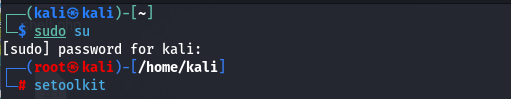
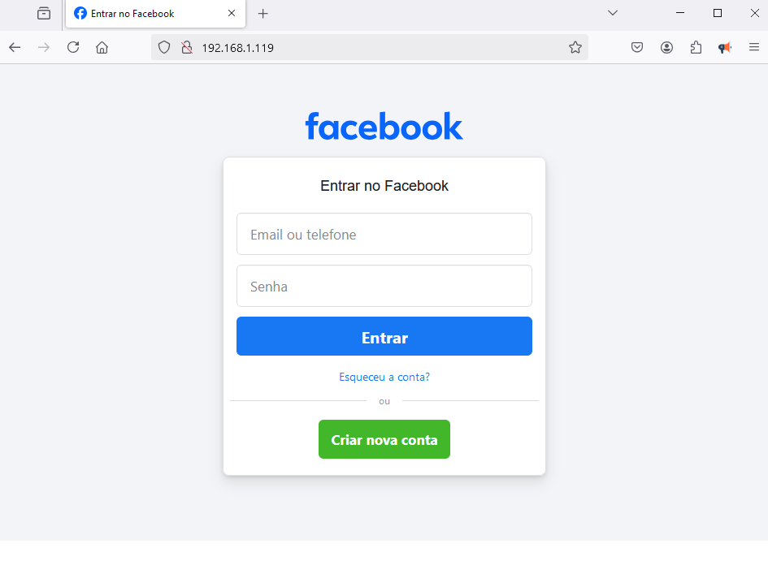

# Phishing para captura de senhas do Facebook (PT-BR)

### Ferramentas

- Kali Linux
- setoolkit

### Configurando o Phishing no Kali Linux

- Acesso root: ``` sudo su ```
  
  
  
- Iniciando o setoolkit: ``` setoolkit ```
 
  
  
- Tipo de ataque: ``` Social-Engineering Attacks ```
  
  
  
- Vetor de ataque: ``` Web Site Attack Vectors ```
  
  
  
- Método de ataque: ```Credential Harvester Attack Method ```
  
  
  
- Método de ataque: ``` Site Cloner ```
  
  
  
- Obtendo o endereço da máquina: ``` ifconfig ```
  
  
  
- URL para clone: http://www.facebook.com
  
  

### Resutados

- É importante ressaltar que soluções implementadas por navegadores modernos podem inviabilizar a captura de senhas e logins, para efetuar testes ainda se pode utilizar outra VM com windows e acessar a pagina através do explorer desatualizado, que não contenha essas soluções
  
  
  
  

# Phishing to capture Facebook passwords (EN-US)

### Tools

- Kali Linux
- setoolkit

### Setting Up Phishing on Kali Linux

- Root access: ``` sudo su ```

  

- Starting setoolkit: ``` setoolkit ```
 
  

- Attack Type: ``` Social-Engineering Attacks ```
  
  

- Attack vector: ``` Web Site Attack Vectors ```
  
  
  
- Attack method: ```Credential Harvester Attack Method ```
  
  
  
- Attack method: ``` Site Cloner ```
  
  
  
- Getting the machine address: ``` ifconfig ```
  
  
  
- URL to clone: http://www.facebook.com
  
  

### Results

- It is important to note that solutions implemented by modern browsers may make it impossible to capture passwords and logins. To carry out tests, you can still use another VM with Windows and access the page through the outdated explorer, which does not contain these solutions.
  
  
  
  
